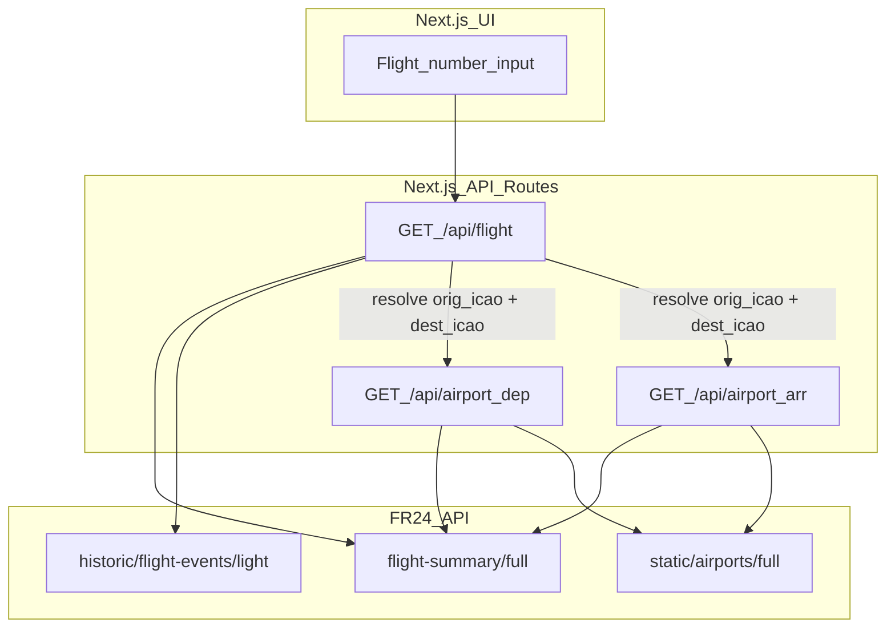

# Business requirements and design document

This specification lives in-repo for version control and sharing. It covers the Flightradar24-powered air traffic analytics web app (Next.js), product strategy, personas, and requirements. **Treat this file as the project source of truth.**

## Implementation checklist

- [x] Single flight number input drives all three reporting containers
- [x] Container 1 — Flight history: last 10 legs with takeoff/landing times, taxi-in/out, aircraft type, flight duration
- [x] Container 2 — Departure airport context: recent departures from origin airport (directional, `outbound:ICAO`)
- [x] Container 3 — Arrival airport context: recent arrivals at destination airport (directional, `inbound:ICAO`)
- [x] Resolve route from flight legs: derive `orig_icao` + `dest_icao` from most recent completed leg
- [x] Switch `/api/airport` from `airports=both:ICAO` to directional filters (`outbound:` / `inbound:`)
- [x] Coverage footers and data-quality labels on all three containers

---

## Flightradar24-powered air traffic analytics

**Document type:** Business requirements (BRD) + product/UX design notes + technical constraints  
**Assumed API tier:** Essential ([Subscriptions & credits](https://fr24api.flightradar24.com/subscriptions-and-credits))  
**Delivery stack:** Next.js (App Router) + server-side FR24 API calls  
**Version:** 2.0

---

## 0. Why this document exists

This file is the single place that ties **why we are building** (product strategy, personas, differentiation), **what we are building** (requirements), **what users see** (UX/design), and **what data we can legally and technically use** (constraints).

---

## 1. Executive summary

We serve **frequent travelers who have already booked a flight** and want to do meaningful pre-trip research using their flight number. They know exactly which flight they're taking. They want to understand how that flight has performed historically and what the airport environments they're passing through actually look like in practice.

The product is built around a **single input: a flight number**. That one input drives three reporting containers shown together on the same page:

1. **Flight history** — the last 10 legs operated under that flight number, showing historical takeoff and landing times, taxi-in and taxi-out times, aircraft type, and flight duration.
2. **Departure airport context** — recent departures from the origin airport (resolved from the flight's route), giving the traveler a real picture of how that airport performs as a departure experience.
3. **Arrival airport context** — recent arrivals at the destination airport, giving the traveler a real picture of what arriving there actually looks like.

---

## 2. Product strategy

### 2.1 Vision and positioning

This product is **not** a substitute for Google Flights, airline apps, or airport home pages. Those tools optimize for **itineraries**: prices, gates, and published departure/arrival times.

Our strategy is to occupy a **narrow adjacent space**: **observed aviation behavior** and **patterns** that are impossible to get from a generic search. We serve **pre-trip research for travelers who already know their flight number**—people who want depth and context about their specific upcoming journey, not another timetable.

### 2.2 Strategic pillars

1. **Flight-number-first** — Everything flows from the flight number. The traveler does not need to know ICAO codes or airport names; the app resolves the route and surfaces context automatically.
2. **Depth over generic search** — Surface historical distributions (flight duration spread, taxi time proxies, equipment used, how busy the arrival airport has been) that no airline app or Google result provides.
3. **Enthusiast-grade detail, traveler-friendly packaging** — Registrations, aircraft types, and timing distributions satisfy spotters; the same data helps frequent flyers build intuition about **how their journey typically goes**.
4. **Observed behavior, not timetables** — Published schedules are not a strategic must-have. FR24's strength is **tracked** flights and events. The analytics catalog (Section 9) is built on that foundation. Reproducing a "next departure" timetable card is out of scope.

### 2.3 Product principles (PM checklist)

- Lead with **one clear insight** per container (e.g. "This flight's typical duration," "How busy arrivals are at your destination").
- Show **coverage** wherever data is partial so trust stays high.
- Prefer **interesting and honest** over **simple and misleading** (no "delay vs schedule" without schedule data).

### 2.4 Strategic success signals

- Users describe the product as the layer **under** the airline app: "how my flight and airports actually operate lately," not "what time is boarding."
- Repeat visits before trips using the same flight number—**habit**, not one-off novelty.

### 2.5 Roadmap placement (strategy summary)

| Horizon | Focus |
|---------|--------|
| **Current baseline** | Single-page Next.js app with flight history + airport context (both directional) from FR24. |
| **Near-term** | Directional airport filters, last-10-legs cap, taxi-in/out enrichment for flight container, coverage footers. |

---

## 3. User personas

Primary design target is **one composite persona** (frequent traveler who is also an aviation enthusiast). Copy and marketing can emphasize travel or spotting, but **one feature set** serves both.

### 3.1 Primary persona: "Alex" — Frequent traveler + aviation enthusiast

**Sketch:** Has already booked a flight. Knows the flight number. Travels several times a year or more; uses airline apps for bookings; enjoys following flights on radar apps, reading trip reports, or caring about aircraft types and airlines.

**Jobs to be done**

- "I've booked flight `KE41`. Before I fly, I want to know: how does this flight **typically** perform? What aircraft does it usually use? How long does it normally take?"
- "What is the departure experience actually like at my origin airport lately? What about arrivals at my destination—how busy is it, how smoothly do flights arrive?"

**Frustrations with Google / generic travel sites**

- Single-query results: **one** next departure or generic airport blurb, not **distributions** or **historical patterns**.
- No aircraft type history, taxi-time insight, or arrival volume context without digging across many sources.
- Even when rich data exists, **jargon and nuance** (UTC vs local, small sample sizes, ICAO codes) make it hard to extract practical meaning.

**Wow moments we want**

- "I didn't realize this flight almost always uses a 777, but occasionally swaps to a 787."
- "Arrivals at my destination have been heavy in the late afternoon this week—good to know before I land."
- "The taxi-out from my departure airport consistently runs 20+ minutes—I should factor that into my connection window intuition."

**Implications for backlog priority**

- P0: last-10-legs flight history with takeoff/landing times, duration, aircraft type, taxi-in/out proxies.
- P0: directional airport context (departures from origin; arrivals at destination) with recent rows and hourly volumes.
- P1: coverage footers explaining data gaps; UTC + airport local time display.
- P2: optional track preview for individual legs.

### 3.2 Secondary persona: "Jordan" — Pure enthusiast (spotter / deep tracker)

**Sketch:** Cares about registrations, types, and paths for fun or planespotting planning.

**Implications:** Same screens; emphasize **registration** and **optional tracks** in the flight history table. Jordan reinforces the **depth** story but is not a separate product line in v1.

### 3.3 Anti-personas (not primary)

- **Fare shopper** — Metasearch wins; we do not compete on price.
- **Certified ops / airline OCC** — Needs regulated tools; we are **exploratory analytics only**.

---

## 4. Goals, non-goals, and success metrics

### 4.1 Goals

- Deliver **credible, interesting** flight history and airport context from a single flight number input.
- Keep **credit/rate-limit** usage predictable (caching, directional filters, user-visible limits).
- Respect **FR24 storage rules** and honest labeling of **data limitations** (coverage, no public schedule feed for classic "delay vs schedule").

### 4.2 Non-goals

- Certified operational or regulatory reporting.
- Global "all airports at once" analytics.
- An independent airport search experience (airports are always reached through a flight number).
- Storing multi-year raw FR24 payloads in a database (see compliance).

### 4.3 Success metrics (product)

- User enters a flight number and sees all three containers load without errors on a "healthy" flight (data exists).
- User completes the full flow—flight history + both airport contexts—in under 90 seconds after first visit.
- **Support burden:** users understand why a metric is "N/A" (tooltips / data coverage footers).

---

## 5. Stakeholders and roles

- **Product owner:** defines priority of metrics and copy ("practical" vs "enthusiast depth"); owns persona fit and differentiation vs generic travel search.
- **Builder:** implements Next.js + server-side FR24 services; manages API token and deploy secrets.
- **End users:** primarily **Alex** (frequent traveler + enthusiast) and secondarily **Jordan** (pure enthusiast); copy must clarify operational vs schedule claims.

---

## 6. Compliance and data constraints (non-negotiable)

| Topic | Requirement | Product implication |
|--------|-------------|-------------------|
| Storage | FR24: accumulated API data not stored **> 30 days** from first receipt ([Storage rules](https://fr24api.flightradar24.com/docs/storage-rules)) | Rolling retention for raw pulls; prefer on-the-fly aggregates; document deletion approach. |
| Schedules | No full timetable/schedule product via API for classic delay KPIs ([FAQ](https://fr24api.flightradar24.com/docs/faq)) | Use terms like **operational timing**, **taxi-time proxy**, **airborne time** — not "official delay." |
| Credits / limits | Per-entity pricing; Essential has higher response limits and rate limits than Explorer ([Subscriptions & credits](https://fr24api.flightradar24.com/subscriptions-and-credits)) | Pagination, `limit` discipline, cache TTL, optional "estimated credits" label. |
| Accuracy | Coverage gaps, estimation possible per FR24 docs/FAQ | Show **coverage %** and null counts on derived metrics. |

---

## 7. User journeys

### 7.1 Primary journey: research my upcoming flight

1. Open the app.
2. Enter **flight number** (e.g. `KE41`) in the single search input.
3. App fetches the last 10 legs for that flight number and resolves the route (`orig_icao` + `dest_icao` from the most recent completed leg).
4. **Container 1 — Flight history** loads: table of last 10 legs with takeoff/landing times, flight duration, aircraft type, and taxi-in/taxi-out where gate event data is available.
5. **Container 2 — Departure airport context** loads: recent departures from the origin airport, with hourly volume and recent departure rows.
6. **Container 3 — Arrival airport context** loads: recent arrivals at the destination airport, with hourly volume and recent arrival rows.
7. User reads coverage footers to understand data gaps.
8. (Optional) User clicks **Load track** for a specific leg to see the flight path (explicit credit-heavy action).

---

## 8. Functional requirements

### 8.1 Global

| ID | Requirement |
|----|-------------|
| FR-G-1 | All FR24 calls run **server-side**; token never sent to browser. |
| FR-G-2 | **Loading** states for any action > 2s. |
| FR-G-3 | **Empty state** when zero rows; suggest broader window or different flight number. |
| FR-G-4 | **Error state** for 401/403/429/5xx with human-readable guidance. |
| FR-G-5 | Display **UTC** always; optionally show **airport local** when airport context is known (timezone from Airports full). |
| FR-G-6 | **Data / coverage** footer on each container: limitations + link to FR24 API docs. |

### 8.2 Flight history container (FR-FN-*)

| ID | Requirement |
|----|-------------|
| FR-FN-1 | Accept flight number input; **normalize** (strip spaces, upper case; map IATA airline prefix + numeric to FR24 query form). |
| FR-FN-2 | Fetch the **last 10 completed legs** for the entered flight number via `flight-summary/full`; sort descending by takeoff time. |
| FR-FN-3 | For each leg show: date, origin, destination, **takeoff time** (UTC + local), **landing time** (UTC + local), aircraft type, registration. |
| FR-FN-4 | For each leg compute and show **flight duration** (landed − takeoff) where both timestamps exist; show coverage % when unavailable. |
| FR-FN-5 | For each leg show **taxi-out proxy** (`takeoff − gate_departure`) and **taxi-in proxy** (`gate_arrival − landed`) via historic flight events; show coverage % when gate events are absent. |
| FR-FN-6 | Show **summary stats**: median flight duration, most common aircraft type, route mode (most common origin/destination pair). |
| FR-FN-7 | Optional: fetch **flight tracks** only on explicit user action per leg. |

### 8.3 Departure airport context container (FR-DC-*)

| ID | Requirement |
|----|-------------|
| FR-DC-1 | Resolve **origin airport** (`orig_icao`) from the most recent completed leg in the flight history result. |
| FR-DC-2 | Fetch recent **departures only** from the origin airport using `airports=outbound:ICAO` filter (directional). |
| FR-DC-3 | Show **departures per hour** time series (last 24h or configured window) in airport local timezone. |
| FR-DC-4 | Show **recent departure rows**: flight, destination, scheduled/actual takeoff time, aircraft type where available. |
| FR-DC-5 | Show airport name, IATA/ICAO, city, country, and timezone clearly labeled. |
| FR-DC-6 | Show data coverage footer: window, row count, any gaps. |

### 8.4 Arrival airport context container (FR-AC-*)

| ID | Requirement |
|----|-------------|
| FR-AC-1 | Resolve **destination airport** (`dest_icao`) from the most recent completed leg in the flight history result. |
| FR-AC-2 | Fetch recent **arrivals only** at the destination airport using `airports=inbound:ICAO` filter (directional). |
| FR-AC-3 | Show **arrivals per hour** time series (last 24h or configured window) in airport local timezone. |
| FR-AC-4 | Show **recent arrival rows**: flight, origin, actual landing time, aircraft type where available. |
| FR-AC-5 | Show airport name, IATA/ICAO, city, country, and timezone clearly labeled. |
| FR-AC-6 | Show data coverage footer: window, row count, any gaps. |

---

## 9. Analytics catalog (what we show and how we define it)

Use this table in implementation and UI tooltips.

### 9.1 Flight history metrics

| Metric | Definition | Primary FR24 source | Key fields | Caveats |
|--------|------------|---------------------|------------|---------|
| Takeoff time | UTC timestamp of wheels-off | Flight summary light | `datetime_takeoff` | May be absent for incomplete or live legs. |
| Landing time | UTC timestamp of wheels-on | Flight summary light | `datetime_landed` | May be absent for incomplete or live legs. |
| Flight duration | `datetime_landed − datetime_takeoff` | Flight summary light | Both timestamp fields | Only computed for completed legs with both timestamps. |
| Aircraft type | ICAO type code | Flight summary light | `type` | Missing type is common; show coverage %. |
| Registration | Tail number | Flight summary light | `reg` | Interesting but not fleet assignment truth. |
| Route mode | Most common (orig, dest) pair across last 10 legs | Flight summary light | `orig_icao`, `dest_icao` | Seasonal routes may show multi-modal distribution. |
| Taxi-out proxy | `datetime_takeoff − datetime_gate_departure` | Historic flight events light | `gate_departure`, `takeoff` event types | Gate events often missing — always show coverage %. |
| Taxi-in proxy | `datetime_gate_arrival − datetime_landed` | Historic flight events light | `landed`, `gate_arrival` event types | Same caveat. |

### 9.2 Departure airport context metrics

| Metric | Definition | Primary FR24 source | Key fields | Caveats |
|--------|------------|---------------------|------------|---------|
| Departures per hour | Count of departed flights per clock hour in airport local TZ | Flight summary light (`outbound:ICAO`) | `datetime_takeoff` | Only counts legs with a confirmed takeoff timestamp. |
| Recent departures table | Last N departure rows for this airport | Flight summary light | `flight`, `dest_icao`, `datetime_takeoff`, `type` | Window and row cap apply; older rows may be missing. |
| Peak departure hour | Hour bucket with most departures in the window | Derived from departures series | Hourly buckets | DST handled only if local TZ is applied. |

### 9.3 Arrival airport context metrics

| Metric | Definition | Primary FR24 source | Key fields | Caveats |
|--------|------------|---------------------|------------|---------|
| Arrivals per hour | Count of arrived flights per clock hour in airport local TZ | Flight summary light (`inbound:ICAO`) | `datetime_landed` | Only counts legs with a confirmed landing timestamp. |
| Recent arrivals table | Last N arrival rows for this airport | Flight summary light | `flight`, `orig_icao`, `datetime_landed`, `type` | Window and row cap apply; older rows may be missing. |
| Peak arrival hour | Hour bucket with most arrivals in the window | Derived from arrivals series | Hourly buckets | DST handled only if local TZ is applied. |

---

## 10. FR24 API mapping (engineering backbone)

| Feature | Endpoint | Notes |
|---------|----------|--------|
| Flight history (last 10 legs) | `GET /api/flight-summary/full` with `flights=` | Sort desc, limit 10. Returns `orig_iata`, `dest_iata`, `orig_icao`, `dest_icao`, `datetime_takeoff`, `datetime_landed`, `type`, `reg`, `fr24_id`. |
| Route resolution | Derived from flight summary result | Use `orig_icao` + `dest_icao` from most recent completed leg. |
| Taxi-out / taxi-in proxies | `GET /api/historic/flight-events/light` | Batch by `fr24_id`; filter for `gate_departure` and `gate_arrival` event types. Data available from 2022-06-01. |
| Departure airport context | `GET /api/flight-summary/full` with `airports=outbound:ICAO` | Directional filter; returns only departing flights. |
| Arrival airport context | `GET /api/flight-summary/full` with `airports=inbound:ICAO` | Directional filter; returns only arriving flights. |
| Airport metadata (name, TZ, IATA) | `GET /api/static/airports/{icao}/full` | Used to display airport name and convert timestamps to local timezone. |
| On-demand track | `GET /api/flight-tracks` | Requires `fr24_id`; credit-heavy; on-demand only per explicit user action. |

Authoritative references: [Endpoints overview](https://fr24api.flightradar24.com/docs/endpoints/overview), [Flight Summary](https://fr24api.flightradar24.com/docs/endpoints/flight-summary).

---

## 11. UX and visual design

### 11.1 Information architecture

Single page, single input. No separate airport page. Route is always resolved through the flight number.

```
[Search bar: flight number input + Submit]
        ↓
[Container 1: Flight history]
[Container 2: Departure airport context]
[Container 3: Arrival airport context]
```

### 11.2 Layout pattern

1. **Search bar** — prominent at top; single text input, normalized on submit (trim + uppercase).
2. **Container 1 — Flight history**
   - Header: flight number + resolved route (e.g. "KE41 · ICN → JFK")
   - Summary strip: median duration · most common aircraft type · route mode
   - Table: last 10 legs with takeoff, landing, duration, type, registration, taxi-in, taxi-out (coverage-flagged)
3. **Container 2 — Departure airport context**
   - Header: departure airport name + IATA/ICAO + city/country
   - Hourly departures bar chart (last 24h in local TZ)
   - Table: recent departure rows
   - Coverage footer
4. **Container 3 — Arrival airport context**
   - Header: arrival airport name + IATA/ICAO + city/country
   - Hourly arrivals bar chart (last 24h in local TZ)
   - Table: recent arrival rows
   - Coverage footer

All three containers load in parallel after the flight history resolves the route.

### 11.3 Visual style

- **Color:** one neutral background, one accent (blue or teal), semantic red only for errors.
- **Typography:** modern sans-serif; emphasize numbers in summary tiles.
- **Charts:** interactive bar charts with hover tooltips (hours labeled in local TZ with UTC offset noted).
- **Copy:** avoid "delay"; prefer "operational timing," "taxi-time proxy," "observed duration."

### 11.4 Accessibility

- High-contrast theme; descriptive ARIA labels on charts.
- Keyboard navigable search input and table rows.
- All time values labeled with timezone (local + UTC equivalent).

---

## 12. Technical architecture



**Route resolution flow:**

1. `GET /api/flight?flight=KE41` → fetches last 10 legs → returns legs + resolved `orig_icao` + `dest_icao`.
2. UI fires `GET /api/airport?airport=RKSI&direction=dep` and `GET /api/airport?airport=KJFK&direction=arr` in parallel.
3. Airport route uses directional `airports=outbound:ICAO` or `airports=inbound:ICAO` based on `direction` param.

---

## 13. Caching, pagination, and cost controls

- **Cache:** in-process TTL cache keyed by `(endpoint, params)` with TTL **30 minutes** for flight and airport data.
- **Flight history:** hard cap at **10 legs** per user action; do not paginate further automatically.
- **Airport directional fetch:** window default **24h** (configurable via `DEV_WINDOW_HOURS`); row cap **300** per time slice with binary-split pagination if limit is hit.
- **Gate events:** batch by `fr24_id` in groups of 10; respect 400ms minimum gap between requests; retry once on 429 after 62s.
- **Tracks:** never auto-fetch for all rows; user must click per leg.

---

## 14. Acceptance criteria (MVP)

### Flight history container

- Given a valid flight number with history, the container shows at least `fr24_id`, origin, destination, takeoff time, landing time, and aircraft type.
- Given a flight number with taxi event coverage, taxi-in and taxi-out values appear; where absent, coverage % is shown rather than an error.
- Given malformed input, app shows a validation message (not a stack trace).
- Median duration and route mode summary tiles are populated.

### Departure airport context container

- Given a resolved `orig_icao`, the container shows a departures-per-hour chart for the last 24h and a recent departures table.
- Container uses `airports=outbound:ICAO` filter (not `both`); no arrivals appear in this section.
- Airport name, IATA, city, country, and timezone are displayed.

### Arrival airport context container

- Given a resolved `dest_icao`, the container shows an arrivals-per-hour chart for the last 24h and a recent arrivals table.
- Container uses `airports=inbound:ICAO` filter (not `both`); no departures appear in this section.
- Airport name, IATA, city, country, and timezone are displayed.

### Global

- Token is read only from **environment variable**; app runs without printing the token.
- All three containers load from a single flight number entry; the user does not need to enter airport codes.
- Empty states display without crashing when FR24 returns zero rows.

---

## 15. Release plan

| Phase | Scope |
|-------|--------|
| **Baseline (current)** | Next.js app with single-page flight history table + airport container using `both:ICAO`. Single flight number input. |
| **v1.0** | Three containers: flight history (last 10 legs) + directional departure context + directional arrival context. Taxi-in/out enrichment for flight history. Summary tiles per container. |
| **v1.1** | Coverage footers on all containers. UTC + airport local time display. Hourly chart for both airport containers. |
| **v1.2** | Aircraft type and registration in airport context tables. Optional CSV export for flight history. |

---

## 16. Risks and mitigations

| Risk | Mitigation |
|------|------------|
| Credit burn from naive loops | Cache, row caps, count endpoint where useful, user confirmation for tracks. |
| Misinterpretation as official delays | Clear copy + coverage footers + FAQ panel. |
| Flight number resolves ambiguously (same number, multiple carriers) | Show airline code assumption in container header; allow user to narrow later. |
| Route resolution fails (no completed legs in window) | Empty state with guidance to try a longer lookback or verify flight number. |
| Sparse gate events for taxi proxies | Always show coverage % for taxi-in/out columns. |
| Directional FR24 filter (`outbound:` / `inbound:`) behaves differently from `both:` | Validate in engineering spike before v1.0 ships; document any behavioral gaps in §17. |

---

## 17. Open decisions (record when chosen)

- **Public deployment vs private demo** — **Decided: private, invitation-only.** The site is gated behind a shared `SITE_PASSWORD` (set via environment variable). Additionally, `/api/flight` and `/api/airport` enforce a 5-requests-per-minute per-IP rate limit to prevent FR24 credit exhaustion, and `/api/access` limits password attempts to 5 per 15 minutes per IP.
- Whether to expose a `lookbackDays` control to the user for flight history (currently env-driven).
- Whether the airport context window (currently 24h) should be user-selectable or fixed.
- **Directional airport API filter:** confirmed that FR24 uses `airports=outbound:ICAO` and `airports=inbound:ICAO` (not `dep:` / `arr:`). Validated against `both:ICAO` — directional filters are now in production.

