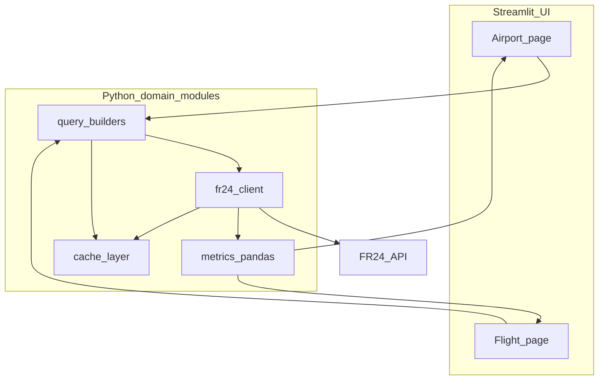
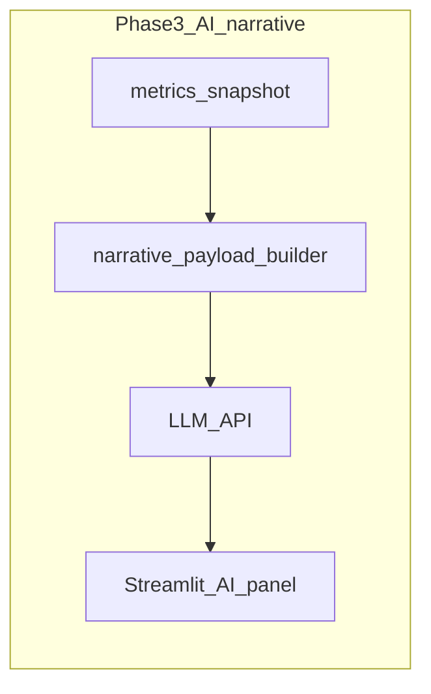

# Business requirements and design document

This specification lives in-repo for version control and sharing. It covers a Streamlit-first MVP using the Flightradar24 API (Essential tier), product strategy, personas, requirements, and a late-phase AI narrative layer. A parallel copy may exist in local Cursor plan storage; **treat this file as the project source of truth** when they differ.

## Implementation checklist

- [ ] Freeze MVP scope: airport + flight-number pages; default 7-day window; About/Legal copy for data retention
- [ ] Define `fr24_analytics/` (client, queries, metrics, caching) separate from `streamlit_app.py`
- [ ] Two-page Streamlit layout: sidebar, metrics, charts, data-quality footers
- [ ] Phase 2: choose Next.js + BFF vs FastAPI + SPA; expose OpenAPI-shaped JSON from the metrics layer
- [ ] Phase 3: AI synthesis agent — grounded metric payload, LLM, disclaimers; align with privacy and FR24 storage rules

---

## Flightradar24-powered air traffic analytics (Streamlit MVP → web)

**Document type:** Business requirements (BRD) + product/UX design notes + technical constraints  
**Assumed API tier:** Essential ([Subscriptions & credits](https://fr24api.flightradar24.com/subscriptions-and-credits))  
**Phase 1 delivery:** Python + Streamlit dashboard  
**Version:** 1.3 (+ late-stage AI narrative / synthesis agent)

---

## 0. Why this document exists

This file is the single place that ties **why we are building** (product strategy, personas, differentiation), **what we are building** (requirements), **what users see** (UX/design), **what data we can legally and technically use** (constraints), and **how we evolve** to a full website without starting analytics from scratch.

---

## 1. Executive summary

We will ship a **two-area analytics experience** for **frequent travelers who are also aviation enthusiasts**—people who want **airport and flight “texture”** (who flies, where, with what aircraft, how busy it is) that **generic search and airline apps do not surface**, not another timetable clone.

1. **Airport hub** — user picks an airport (dropdown) and sees traffic, airline/aircraft mix, route leaders, and operational timing insights derived from FR24 historical/summary data over a selectable short window (default 7 days).
2. **Flight number lens** — user enters a commercial flight number and sees recent leg history, route consistency, timing distributions, and optional deep dives (e.g. track) where cost and data allow.
3. **Late-stage: AI-assisted narrative (post–core analytics maturity)** — an agent summarizes the **already-computed** charts and KPIs into short, plain-language takeaways (e.g. what a high diversion rate might imply, what “peak hour” means for the user’s selected window)—see Section 18.

**Phase 1** is a **Streamlit** app for speed. Core logic lives in **importable Python modules** so **Phase 2** can add a “real” web UI and API without re-deriving metrics.

---

## 2. Product strategy

### 2.1 Vision and positioning

This product is **not** a substitute for Google Flights, airline apps, or airport home pages. Those tools optimize for **itineraries**: prices, gates, and **published** departure/arrival times.

Our strategy is to occupy a **narrow adjacent space**: **observed aviation behavior** and **patterns** that are hard to get from a generic search—who is actually moving at an airport, on which routes, with which aircraft, and how stable that picture is over recent weeks. We serve **curiosity, trip intuition, and enthusiast depth**, not commoditized timetable rows.

### 2.2 Strategic pillars

1. **Depth over generic search** — Surface aggregates and distributions (movements by day/hour, airline and aircraft mix, top routes, diversion signals, operational timing proxies) that a Google answer box or a single flight card does not provide.
2. **Enthusiast-grade detail, traveler-friendly packaging** — Registrations, operator vs marketing carrier (`operated_as` vs `painted_as`), route stability, and optional tracks satisfy spotters; the same views help frequent flyers build intuition about **how busy or variable** their hubs feel in practice.
3. **Differentiation vs “standard web” info** — Generic results prioritize **the next flight** and static facts. We prioritize **comparative context**: how an airport or flight number **behaved recently** as a system (volume, mix, patterns)—aligned with FR24’s strengths as a tracking-derived dataset.
4. **Unique analytics first; timetable parity optional** — Published departure/arrival times are **not** a strategic must-have for v1. FR24’s API focus is on **tracked** flights and events, not full public schedules ([FAQ](https://fr24api.flightradar24.com/docs/faq)). We **embrace that fit**: the analytics catalog (Section 9) is **P0**; reproducing Google-style “what time is my flight” is **P2 or out of scope**. Observed timestamps support **pattern** metrics (e.g. airborne duration, peak banks, proxies where events exist), not schedule-delay claims.
5. **Interpretability through synthesis (late stage)** — Our charts and KPIs are **niche and technical** (ICAO codes, diversion rates, taxi proxies, coverage). Many users in the Alex persona will ask **“so what?”** After core analytics are stable, we add an **AI narrative layer** that turns **the same numbers already on screen** (plus definitions and caveats) into **short, contextual explanations**—not new hidden data. Examples: *What might it mean if diversion rate looks high for this airport and window?* *What does peak hour here tell me about congestion or bank structure—without claiming a cause?* This pillar is **explicitly after** MVP 0.1–0.3; see Section 18 and the release plan.

### 2.3 Product principles (PM checklist)

- Lead with **one clear insight** per screen (e.g. “Busiest hours this week,” “This flight’s usual city pair”).
- Show **coverage** wherever data is partial so trust stays high.
- Prefer **interesting and honest** over **simple and misleading** (no “delay vs schedule” without schedule data).
- Treat expensive calls (**flight tracks**) as **opt-in** actions.
- When AI is enabled: **never** present model prose as operational fact; **ground** summaries in cited metrics; show **disclaimer** and **regenerate** control.

### 2.4 Strategic success signals

- Users describe the product as the layer **under** the airline app: “how my airport actually operates lately,” not “what time is boarding.”
- Repeat visits: same airports, same flight numbers before trips—**habit**, not one-off novelty.
- (Late stage) Users report the **AI summary** helped them understand **one metric they would have skipped** (e.g. diversion rate, peak hour) without feeling misled.

### 2.5 Roadmap placement (strategy summary)

| Horizon | Focus |
|---------|--------|
| **Now–MVP 0.3** | Ship analytics + charts + coverage footers; no generative AI dependency. |
| **Phase 2** | Optional full web shell; still human-written tooltips and static “What is this?” copy. |
| **Phase 3 / late product** | **AI narrative agent**: server-side synthesis from structured summaries of on-page data; optional follow-up questions in scope only if grounded and safe. |

---

## 3. User personas

Primary design target is **one composite persona** (frequent traveler **and** aviation enthusiast). Copy and marketing can emphasize travel or spotting, but **one feature set** should serve both.

### 3.1 Primary persona: “Alex” — Frequent traveler + aviation enthusiast

**Sketch:** Travels several times a year or more; uses airline apps for bookings; enjoys following flights on radar apps, reading trip reports, or caring about aircraft types and airlines.

**Jobs to be done**

- **Airport:** “Before I fly through `X`, what does activity there **look like** lately—how busy, who dominates, which routes are huge?”
- **Flight number:** “For the flight I often take, is it **always** the same pair of cities and equipment, or does it vary? Anything **weird** lately (e.g. diversion)?”

**Frustrations with Google / generic travel sites**

- Single-query results: **one** next departure or generic airport blurb, not **distributions** or **ecosystem** view.
- No **operator vs livery**, **aircraft mix**, **route leaderboard**, or **recent pattern** without digging across many sources.
- Even when we show rich charts, **jargon and nuance** (e.g. diversion %, peak hour in UTC vs local, small sample sizes) make it hard to extract **meaning** without a guided narrative.

**Wow moments we want**

- “I didn’t realize **this much** traffic at my airport was **airline Y** / **type Z** this month.”
- “My usual flight number **mostly** does `A→B`, but here’s the **spread** and one odd diversion.”

**Implications for backlog priority**

- P0: movements over time, airline/aircraft mix, top routes, diversions, peak-hour views, flight-number leg history and route mode.
- P1: taxi / gate **proxies** where event coverage allows, with explicit coverage stats.
- P2: anything that merely **duplicates** a timetable UI.
- **P3 (late product):** **AI synthesis** block on each main view—plain-language “so what” tied to visible KPIs (Section 18).

### 3.2 Secondary persona: “Jordan” — Pure enthusiast (spotter / deep tracker)

**Sketch:** Cares about registrations, types, and paths for fun or planespotting planning.

**Implications:** Same screens; emphasize **registration** and **optional tracks** in the flight table and CTAs. Jordan reinforces the **depth** story but is not a separate product line in v1.

### 3.3 Anti-personas (not primary in v1)

- **Fare shopper** — Metasearch wins; we do not compete on price.
- **Certified ops / airline OCC** — Needs regulated tools; we are **exploratory analytics only**.

---

## 4. Goals, non-goals, and success metrics

### 4.1 Goals

- Demonstrate **credible, interesting** airport and flight-level analytics from FR24.
- Keep **credit/rate-limit** usage predictable (caching, pagination, user-visible limits).
- Respect **FR24 storage rules** and honest labeling of **data limitations** (coverage, no public schedule feed for classic “delay vs schedule”).
- **Late-stage goal:** Help users interpret technical metrics via an **AI-generated narrative** that is **grounded in the computed aggregates** shown on the page (not speculative real-time ops claims).

### 4.2 Non-goals (v1)

- Certified operational or regulatory reporting.
- Global “all airports at once” analytics.
- Storing multi-year raw FR24 payloads in your database (see compliance).
- **MVP 0.1–0.3:** No **generative AI** dependency; static tooltips and docs only.
- **Any AI phase:** No **ungrounded** claims (e.g. “your flight will be late”); no presenting LLM text as **official** airline or airport guidance.

### 4.3 Success metrics (product)

- User completes **airport** flow end-to-end in under 60 seconds after first visit.
- User completes **flight number** flow with at least one chart and one table without errors on a “healthy” flight (data exists).
- **Support burden:** users understand why a metric is “N/A” (tooltips / data coverage footers).
- **Phase 3:** Users report the AI panel clarified **at least one** metric (e.g. diversion rate, peak hour) without increasing mistaken belief that the app is “official” ops guidance (spot-check disclaimer visibility).

---

## 5. Stakeholders and roles

- **Product owner:** defines priority of metrics and copy (“fun” vs “serious”); owns persona fit and differentiation vs generic travel search.
- **Builder (you):** implements Streamlit + Python services; manages API token and deploy secrets.
- **End users:** primarily **Alex** (frequent traveler + enthusiast) and secondarily **Jordan** (pure enthusiast); copy must clarify operational vs schedule claims (see Sections 2–3); AI narrative (Section 18) must reinforce the same honesty bar.

---

## 6. Compliance and data constraints (non-negotiable)

| Topic | Requirement | Product implication |
|--------|-------------|-------------------|
| Storage | FR24: accumulated API data not stored **> 30 days** from first receipt ([Storage rules](https://fr24api.flightradar24.com/docs/storage-rules)) | Rolling retention for raw pulls; prefer on-the-fly aggregates; document deletion approach. |
| Schedules | No full timetable/schedule product via API for classic delay KPIs ([FAQ](https://fr24api.flightradar24.com/docs/faq)) | Use terms like **operational timing**, **taxi-time proxy**, **airborne time** — not “official delay.” |
| Credits / limits | Per-entity pricing; Essential has higher response limits and rate limits than Explorer ([Subscriptions & credits](https://fr24api.flightradar24.com/subscriptions-and-credits)) | Pagination, `limit` discipline, cache TTL, optional “estimated credits” label. |
| Accuracy | Coverage gaps, estimation possible per FR24 docs/FAQ | Show **coverage %** and null counts on derived metrics. |
| **AI / LLM** | Third-party model providers process **prompts**; may include **aggregated** metric JSON + metric definitions (not necessarily raw FR24 payloads) | Disclose provider; minimize PII; **opt-in** or clear affordance; retention policy for prompts/responses; user-facing **disclaimer** (“educational, not operational”); align any stored logs with **30-day** posture where applicable. |

---

## 7. User journeys and epics

### 7.1 Airport journey

1. Open **Airport** page.
2. Choose **date window** (7 / 14 / 30 days).
3. Choose **airport** from dropdown (IATA/ICAO).
4. Choose **movement type** filter: departures, arrivals, or both (recommended v1: both with clear labeling).
5. View **KPI row**, **charts**, **tables**, and **footnotes**.
6. (Optional v1.1) Download CSV for current table.
7. **(Phase 3)** Open **AI summary** (or “Explain this view”) to read a short synthesis of the **current** airport metrics and charts (e.g. diversion rate in context, peak hour interpretation for the selected window and timezone).

### 7.2 Flight number journey

1. Open **Flight** page.
2. Enter **flight number** (free text).
3. Choose **date window** (default 14–30 days per credit policy).
4. View **summary stats** + **legs table**.
5. (Optional) Click **Load track** for one `fr24_id` (explicit cost action).
6. **(Phase 3)** Use **AI summary** to interpret leg history, route stability, and timing spread in plain language (still grounded in table/chart values).

---

## 8. Functional requirements

### 8.1 Global (both pages)

| ID | Requirement |
|----|-------------|
| FR-G-1 | All FR24 calls run **server-side**; token never sent to browser. |
| FR-G-2 | **Loading** states for any action > 2s. |
| FR-G-3 | **Empty state** when zero rows; suggest broader window or different filter. |
| FR-G-4 | **Error state** for 401/403/429/5xx with human-readable guidance. |
| FR-G-5 | Display **UTC** always; optionally show **airport local** when airport context known (timezone from Airports full). |
| FR-G-6 | **About / Data** expander: limitations + link to FR24 API docs. |

### 8.2 Airport page

| ID | Requirement |
|----|-------------|
| FR-AP-1 | Dropdown to select **one** airport at a time (v1). |
| FR-AP-2 | Airport list sourced from **cached** static list (JSON) seeded from FR24 Airports light/full + periodic refresh job, or from bundled top-N list for MVP. |
| FR-AP-3 | Filters: date window; movement direction (inbound/outbound/both) mapped to FR24 `airports=` filter semantics ([Flight Summary](https://fr24api.flightradar24.com/docs/endpoints/flight-summary)). |
| FR-AP-4 | Show **movements per day** time series. |
| FR-AP-5 | Show **top airlines** by movement count (`operated_as` primary; optional toggle `painted_as`). |
| FR-AP-6 | Show **top routes** (other airport endpoint) for selected direction. |
| FR-AP-7 | Show **aircraft type** distribution (ICAO type). |
| FR-AP-8 | Show **diversion indicator** when actual destination ≠ planned (field-dependent). |
| FR-AP-9 | If historic events used: show **taxi-out / taxi-in proxy** distributions **only** when both timestamps exist; show **coverage %**. |

### 8.3 Flight number page

| ID | Requirement |
|----|-------------|
| FR-FN-1 | Accept flight number input; **normalize** (strip spaces, upper case; map common IATA airline prefix + numeric to query form accepted by API). |
| FR-FN-2 | Query **Flight summary** by `flights=` + time range (per docs); paginate if needed. |
| FR-FN-3 | Table of legs: date, origin, dest, times, airline codes, reg/type if present, `fr24_id`. |
| FR-FN-4 | Summary: leg count, route mode, median/p90 airborne time when computable. |
| FR-FN-5 | Optional: fetch **flight tracks** only on explicit user action per leg. |

### 8.4 AI narrative agent (Phase 3 — late product)

| ID | Requirement |
|----|-------------|
| FR-AI-1 | **Input grounding:** Model receives only a **structured snapshot** of metrics already computed for the current view (e.g. JSON: diversion_rate, n_legs, peak_hour_local, top_airlines, date_range, coverage flags)—plus **embedded metric definitions** from the analytics catalog (Section 9). |
| FR-AI-2 | **Output:** Short sections: **Summary** (3–5 bullets), **What to watch** (caveats: small N, UTC vs local, tracking gaps), **Not claims** (no “you will miss your connection”). |
| FR-AI-3 | **UX:** Collapsible **“AI explanation”** panel; **Regenerate**; visible **disclaimer**; optional **Ask a follow-up** only if prompts stay constrained to on-screen data. |
| FR-AI-4 | **Server-side only:** API keys for LLM provider in environment/secrets; no keys in browser. |
| FR-AI-5 | **Cost control:** Rate-limit AI calls per session/IP; cache by `(view, airport/flight, window, metric_hash)` with short TTL. |
| FR-AI-6 | **Example prompts (product copy):** “Why might diversion rate matter here?” “What does peak hour mean for the dates I selected?” System prompt instructs the model to **cite** numbers from the payload and to **avoid** inventing causes (weather, strikes) unless labeled as general education not tied to this dataset. |

---

## 9. Analytics catalog (what we show and how we define it)

Use this table in implementation and UI tooltips.

### 9.1 Airport metrics

| Metric | Definition | Primary FR24 source | Key fields | Caveats |
|--------|------------|---------------------|------------|---------|
| Movements per day | Count of flight legs matching airport filter per calendar day (UTC or local toggle) | Flight summary light/full | `first_seen` or takeoff/land fields depending on filter | Incomplete legs may skew “day.” |
| Peak hour | Hour bucket with most movements | Same | timestamp of chosen event | DST handled only if local TZ applied. |
| Top airlines | Count by `operated_as` | Flight summary | `operated_as` | `painted_as` may differ; explain in UI. |
| Top routes | Pair counts (airport ↔ other) | Flight summary | origin/dest ICAO/IATA | Direction filter matters. |
| Aircraft mix | Histogram of `type` | Flight summary | `type` | Missing type common. |
| Diversion rate | Share where actual dest ≠ planned dest | Flight summary full | `dest_icao` vs `dest_icao_actual` (names per docs) | Rare events; small denominators noisy. |
| Taxi-out proxy | `takeoff_ts - gate_departure_ts` | Historic flight events | event types `gate_departure`, `takeoff` | Gate events often missing → show coverage. |
| Taxi-in proxy | `gate_arrival_ts - landed_ts` | Historic flight events | `landed`, `gate_arrival` | Same. |
| Airborne time | `landed - takeoff` from events, or `flight_time` from summary full | Events or summary full | timestamps / `flight_time` | Live legs may be incomplete. |

### 9.2 Flight number metrics

| Metric | Definition | Primary FR24 source | Caveats |
|--------|------------|---------------------|---------|
| Legs observed | Rows returned for flight + window | Flight summary | Flight number parsing ambiguity across carriers. |
| Route mode | Most common (orig, dest) pair | Flight summary | Seasonal routes may show multi-modal routes. |
| Airborne median/p90 | From `flight_time` or event diffs | Summary full / events | Requires completed legs. |
| Registration churn | Distinct `reg` count | Flight summary | Interesting but not “fleet assignment truth.” |
| Track preview | Polyline from tracks endpoint | Flight tracks | Credit-heavy; on-demand only. |

---

## 10. FR24 API mapping (engineering backbone)

| Feature | Endpoint (conceptual) | Notes |
|---------|----------------------|--------|
| Airport dropdown metadata | Airports light / Airports full | Full gives timezone; Essential includes full per plan page. |
| Airport movements, routes, mix | Flight summary light or full | Use `airports=` filters; mind 14-day max range per flight-summary doc for range queries; chunk if needed. |
| Event-based taxi proxies | Historic flight events light/full | Data from 2022-06-01 per overview. |
| On-demand path | Flight tracks | Requires `fr24_id` from summary/positions. |
| Usage/cost visibility (optional) | Usage endpoint | Helps monitor credits. |
| AI narrative (Phase 3) | Customer-chosen LLM API (OpenAI, Anthropic, etc.) | **No FR24 call**; consumes **aggregates** produced by `fr24_analytics/metrics.py` + schema from Section 8.4. |

Authoritative references: [Endpoints overview](https://fr24api.flightradar24.com/docs/endpoints/overview), [Flight Summary](https://fr24api.flightradar24.com/docs/endpoints/flight-summary), [Python SDK](https://fr24api.flightradar24.com/docs/sdk/python).

---

## 11. UX and visual design (Streamlit Phase 1)

### 11.1 Information architecture

- **Page A:** Airport analytics  
- **Page B:** Flight number analytics  
- **Sidebar:** date window, timezone display mode, optional “max rows” guard, API health note

Use Streamlit `st.navigation` or multipage app pattern.

### 11.2 Layout pattern (each page)

1. **Title + one-sentence value prop**
2. **Controls row** (inputs)
3. **KPI strip** (3–5 `st.metric` tiles)
4. **Primary chart** (time series or bar)
5. **Secondary chart** (distribution or heatmap)
6. **Detail table** (paginated or top-N)
7. **Footer:** data coverage + UTC/local note + FR24 attribution

### 11.3 Visual style

- **Color:** one neutral background, one accent (blue or teal), semantic red only for errors.
- **Typography:** default Streamlit; emphasize numbers in metrics.
- **Charts:** Plotly for interactivity (hover tooltips mandatory).
- **Copy:** avoid “delay”; prefer “operational timing” and “proxy.”

### 11.4 Accessibility (honest)

Streamlit is weaker on WCAG than custom front ends. **Phase 2** should improve keyboard nav and contrast. v1: keep high contrast theme and descriptive labels.

### 11.5 AI narrative panel (Phase 3)

- **Placement:** Below the primary charts or in a **right-hand expander** so the **data remains primary**; AI is **supporting**.
- **Visual:** Distinct panel (e.g. tinted background) with icon + “AI-generated” label.
- **Content pattern:** Bullets + **inline references** to numbers (“Diversion rate **2.1%** over **n=480** legs…”).
- **Empty / low coverage:** If `n` is tiny or diversion denominator small, AI prompt must include **warning**; UI shows “interpret with caution.”

---

## 12. Technical architecture (Phase 1)

**Module layout (recommended):**

- `fr24_analytics/client.py` — auth headers, retries, rate limit handling  
- `fr24_analytics/queries.py` — builds parameters for summary/events/tracks  
- `fr24_analytics/normalize.py` — JSON → data frames  
- `fr24_analytics/metrics.py` — aggregations + coverage stats  
- `streamlit_app/` — pages only; no FR24 details embedded

**Phase 3 add-on (conceptual):**

- `fr24_analytics/narrative_payload.py` — builds **serializable** dict from current DataFrames/metrics for LLM.  
- `fr24_analytics/llm_client.py` — thin wrapper around provider SDK; timeouts and retries.  
- Streamlit: `st.button("Explain this view")` → build payload → call LLM → stream or show result.

---

## 13. Caching, pagination, and cost controls

- **Cache:** in-process LRU or TTL cache keyed by `(endpoint, params)` with TTL **5–15 minutes**.
- **Pagination:** loop with sorted keys (`first_seen` asc/desc per docs) respecting `limit`.
- **Guards:** hard cap on legs pulled per user action; show “refine window” message.
- **Tracks:** never auto-fetch for all rows.

---

## 14. Acceptance criteria (MVP)

### Airport MVP

- Given a selected airport and 7-day window, app shows **non-empty** movements chart when FR24 returns data.
- Given zero results, app shows **empty state** without crashing.
- Airline chart uses **operated_as** by default and explains **painted_as** in tooltip/help.

### Flight MVP

- Given a valid flight number with history, app shows **table** with at least `fr24_id`, origin, dest, and one time column.
- Given malformed input, app shows **validation message** (not stack trace).

### Global

- Token is read only from **environment variable**; app runs without printing token.

### Phase 3 — AI narrative (late)

- Given a populated airport view, **Explain this view** returns text that references **at least two** numeric values from the visible KPI payload (e.g. diversion %, `n`, peak hour).
- Disclaimer and **Regenerate** are always visible; no LLM API key in client bundle.

---

## 15. Release plan

| Phase | Scope |
|-------|--------|
| **MVP 0.1** | Airport page: movements/day + top airlines + top routes; Flight page: legs table + basic summary. |
| **MVP 0.2** | Aircraft mix + diversion rate + coverage footers; optional CSV export. |
| **MVP 0.3** | Historic events integration for taxi proxies + heatmap peak hour. |
| **Phase 2** | External web UI + auth optional + formal API + deploy hardening; reuse `fr24_analytics` package; static tooltips and “What is this metric?” copy (no LLM required). |
| **Phase 3 — late product / interpretability** | **AI narrative agent:** grounded summaries for **Airport** and **Flight** views; disclaimers; server-side LLM; rate limits + caching; optional follow-up Q&A within guardrails. Depends on stable metric schema from 0.2–0.3. **Rationale:** niche metrics (e.g. diversion rate, peak hour, taxi proxies) need **synthesis** so Alex-style users get the “so what” without becoming data experts. |

**Phase 3 success check (product):** User can answer, after reading the panel, *why* a high diversion rate **might** matter (operational variability, not a guaranteed personal outcome) and *what* peak hour represents **for their selected airport and date window** (busiest clock hour by movement count, with UTC/local stated).

---

## 16. Risks and mitigations

| Risk | Mitigation |
|------|------------|
| Credit burn from naive loops | Cache, limits, count endpoint where useful, user confirmation for expensive actions. |
| Misinterpretation as official delays | Clear copy + FAQ panel. |
| Users expect Google-style “next departure” hero | Lead with strategy in UI: **patterns and mix** first; link out for timetables; align with Section 2.2 pillar 4. |
| Sparse gate events | Always show coverage % for taxi proxies. |
| Flight number ambiguity | Show airline code assumption; allow user to narrow by airline ICAO/IATA later. |
| **AI hallucination / overclaim** | Ground on JSON payload only; system prompt + post-check for forbidden phrases; show disclaimer; small-N warnings in payload. |
| **AI cost / abuse** | Rate limit; cache; optional feature flag; require login later if public abuse. |
| **Privacy / data to LLM** | Send **aggregates** only; document provider; opt-in where required by policy. |

---

## 17. Open decisions (record when chosen)

- Public deployment vs private demo (abuse risk).
- Airport list: bundled top 200 vs full searchable catalog.
- Whether v1 includes **any** track fetching.
- **Phase 3:** LLM vendor (OpenAI, Anthropic, Azure OpenAI, local model); streaming vs batch; whether follow-up chat is v3.0 or v3.1; retention of prompts/responses for debugging (default off or ≤30 days).

---

## 18. Late-stage: AI narrative and synthesis agent (specification)

### 18.1 Problem statement

The product’s strength is **niche, tracking-derived analytics** that Google and airline sites do not show. That same strength creates a **comprehension gap**: users see diversion rates, peak hours, and ICAO-heavy tables but may not infer **practical meaning** or **limitations** without help.

### 18.2 Solution outline

An **AI agent** (implemented as a **server-side** call to an LLM) receives a **structured, bounded payload** of numbers and labels **already displayed** on the current screen, plus **metric definitions** from Section 9. It returns a **short narrative** that:

- Explains **what the metrics mean** in plain language.
- Highlights **caveats** (sample size, UTC vs local, incomplete tracking).
- Addresses exemplar questions such as: *If diversion rate is high for this airport and window, what should I think about?* *Which hour had the most movements, and what does that imply about how “busy” the airport was during my selected period?*

The model must **not** fabricate flight-specific predictions or external facts (weather, NOTAMs, strikes) unless clearly separated as **general education** and not asserted for the user’s query.

### 18.3 Implementation notes

- **Grounding contract:** Prompt template includes `METRICS_JSON`, `DEFINITIONS`, `USER_CONTEXT` (airport code, date range, movement filter). Model instructed: every factual claim must map to a field in `METRICS_JSON`.
- **Safety copy:** Fixed footer: exploratory only; not for operational decisions.
- **Testing:** Golden tests on synthetic payloads (high/low diversion, tiny N, missing coverage) to catch overconfident wording.

### 18.4 Relationship to roadmap

This capability is **explicitly Phase 3** so that: (1) metric definitions and aggregates stabilize first; (2) FR24 and Streamlit core paths are debugged without LLM variability; (3) compliance and cost controls can be designed deliberately.

---

## 19. Appendix — Streamlit vs full web (effort, not zero)

| Layer | Reuse when moving to “industry-grade” |
|-------|----------------------------------------|
| FR24 query + metrics + tests | **High** if kept in `fr24_analytics/` |
| Streamlit pages | **Low** (rewritten as React/Next or similar) |
| Auth, SEO, marketing, monitoring | **New** in Phase 2 |
| **AI narrative layer** | **Medium reuse:** `narrative_payload` + prompt contracts stay in Python; UI moves from Streamlit expander to web component; LLM integration portable |

This appendix answers: **Streamlit is the fastest MVP**; **you do not restart from zero** if you isolate domain logic early. The **AI layer** attaches to **stable metric outputs**, so it ships **after** core analytics and migrates with the same payload schema.
